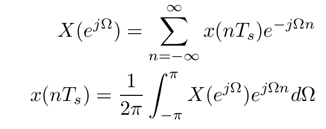

<!-- for math equations - MathJax -->
<script src='https://cdnjs.cloudflare.com/ajax/libs/mathjax/2.7.4/MathJax.js?config=default'></script>
# Transformata Fouriera sygnałów dyskretnych- powtórzenie i podstawowe właściwości

## Wstęp
### Transformata fouriera sygnału dyskretnego, nieskończonego
<!--  -->
$$
X\left(e^{j \Omega}\right)=\sum_{n=-\infty}^{\infty} x\left(n T_{s}\right) e^{-j \Omega n} $$
$$
x\left(n T_{s}\right)=\frac{1}{2 \pi} \int_{-\pi}^{\pi} X\left(e^{j \Omega}\right) e^{j \Omega n} d \Omega
$$

### Transformata Fouriera sygnału o skończonej długości:
<!--  -->
$$
X(k)=\sum_{n=0}^{N-1} x(n) e^{-j \frac{2 \pi}{N} k n}, k=0,1,2 \ldots N-1$$
$$
x(n)=\frac{1}{N} \sum_{k=0}^{N-1} X(k) e^{j \frac{2 \pi}{N} k n}, n=0,1,2 \ldots N-1
$$
Implementacja transformaty może mieć postać:
``` python
import numpy as np
def dft(x):
    x = np.asarray(x, dtype=float)
    N = x.shape[0]
    n = np.arange(N)
    k = n.reshape((N, 1))
    M = np.exp(-2j * np.pi * k * n / N)
    return np.dot(M, x)
```

### Szybka transformata Fouriera (fft)
Złożoność obliczeniowa implementacji dyskretnej transformaty Fouriera wynosi O(N^2). Bardziej wydajną metodą jest wykorzystanie algorytmu szybkiej transformacji Fouriera (O(Nlog(N))), bazującej na [radix-2](https://en.wikipedia.org/wiki/Cooley%E2%80%93Tukey_FFT_algorithm).

Przeanalizuj różnicę w czasie wykonania transformaty między funkcją dft a wbudowaną funkcją fft:
``` python
x = np.random.random(1024)
np.allclose(dft(x), np.fft.fft(x)) #sprawdż czy wniki obu metod są zbliżone

%timeit dft(x)
%timeit np.fft.fft(x)
```
### Częstotliwość Niquista i twierdzenie Shanona
Częstotliwość Nyquista – maksymalna częstotliwość składowych widmowych sygnału poddawanego procesowi próbkowania, które mogą zostać odtworzone z ciągu próbek bez zniekształceń. Składowe widmowe o częstotliwościach wyższych od częstotliwości Nyquista ulegają podczas próbkowania nałożeniu na składowe o innych częstotliwościach (zjawisko aliasingu), co powoduje, że nie można ich już poprawnie odtworzyć.

Zgodnie z twierdzeniem o próbkowaniu, przy próbkowaniu równomiernym z odstępem próbkowania \\(T_{s}\\), warunkiem odtworzenia sygnału jest, aby maksymalna częstotliwość sygnału nie przekraczała połowy częstotliwości próbkowania, \\(f_{max}<f_{s}/2\\) lub \\(f_{max}<1/{2T_{s}}\\)

Załóżmy, że dany jest kod generujący sygnał harmoniczny:
``` python
import pylab as py
import numpy as np
from numpy.fft import rfft, rfftfreq

def sin(f = 1, T = 1, fs = 128, phi =0 ):
	dt = 1.0/fs
	t = np.arange(0,T,dt)
	s = np.sin(2*np.pi*f*t + phi)
	return (s,t)	
```

Spróbuj wygenerować wyznaczyć transformatę Fouriera i wyświetlić ją w postaci modułu (transformata jest zespolona) oraz 2 wykresów zawierających część rzeczywistą i urojoną. Na podstawie wzoru na dft osi x podaj mianowaną w częstotliwości a nie w próbkach. 

``` python
from scipy.fft import fft, fftfreq
fs = 100
T = 1

(y,t) = sin(f = 10.0, T=T, fs=fs)

N=int(Fs*T)

yf = fft(y)
xf = ......
import matplotlib.pyplot as plt
plt.stem(xf, np.abs(yf), use_line_collection=True)
plt.grid()
plt.show()
```
W dalszej części zamiast ręcznego wyznaczania wektora częstotliwości możesz skorzystać z funkcji `fftfreq`
``` python
xf = fftfreq(N, 1/Fs)
```
Jednak musisz wiedzieć jak ten wektor jest generowany i jaka jest wartość pojedynczego kwantu częstotliwości (rozdzielczość widma)

## Zadania
1. Proszę wygenerować sygnał \\(s(t)=sin(2\pi\cdot t \cdot 1)+sin(2\pi \cdot t\cdot3+\pi/5)\\) o długościach 2.5s  próbkowany 100 Hz, obliczyć jego transformatę Fouriera za pomocą fft (\\(X=fft(s)\\)), a następnie zrekonstruować przebieg czasowy za pomocą ifft (\\(\hat{x} = ifft(X)\\)). Sygnał oryginalny i zrekonstruowany wykreślić na jednym rysunku. Uwaga: funkcja ifft zwraca wektor liczb zespolonych. Sprawdź jaka jest jego część urojona. Na wykresie rekonstrukcji przedstaw jego część rzeczywistą. Jaka jest dokładność rekonstrukcji, jeśli sygnał będzie miał długość 3s?
   Dokładność rekonstrukcji zdefiniuj jako błąd średniokwadratowy (RMSE):
   $$
   RMSE=\sum_{i=0}^N \frac{1}{N}\cdot \sqrt{(s(i)- Re(\hat{x} i))^2}
   $$
2. Proszę kolejno wygenerować sinusoidy o długości 1s próbkowaną 32Hz i częstościach 0, 1,10, 16, 17, 31 Hz. Dla tych sinusoid proszę policzyć transformaty Fouriera i wykreślić zarówno sygnały jak i wartość bezwzględne otrzymanych współczynników. (dla pojedynczych sygnałów i  widma zsumowanego sygnału)
- Jak wyglądają otrzymane wykresy?
- Czy coś szczególnego dzieje się dla częstości 0 i 16Hz, 17Hz? Czy w tych skrajnych przypadkach faza sygnału oryginalnego ma wpływ na wynik transformaty?

3. Dla danych wejściowych z zadania 2 zmodyfikuj funkcję `dft`, tak, żeby zwracała widmo w przedziale <0;4f_s> przy zachowaniu dotychczasowej częstotliwości próbkowania. Otrzymane rezultaty zinterpretuj w świetle twierdzenia o próbkowaniu.

4. Z dotychczasowych rozważań o transformacie Fouriera ograniczonych w czasie sygnałów dyskretnych wynika, że w widmie reprezentowane są częstości od \\(−f_n\\) do \\(f_n\\) gdzie \\(f_n\\) to częstości Nyquista. Dostępnych binów częstości jest N - tyle samo ile obserwowanych punktów sygnału.

- jaka jest rozdzielczość częstotliwościowa (odstęp między binami częstotliwości)  dla 1 s sygnału próbkowanego 10Hz?
- jaka jest rozdzielczość częstotliwościowa (odstęp między binami częstotliwości)  dla 1 s sygnału próbkowanego 100Hz?
- jaka jest rozdzielczość częstotliwościowa (odstęp między binami częstotliwości)  dla 1 s sygnału próbkowanego 1000Hz?
- jaka jest rozdzielczość częstotliwościowa (odstęp między binami częstotliwości)  dla 10 s sygnału próbkowanego 10Hz?
- jaka jest rozdzielczość częstotliwościowa (odstęp między binami częstotliwości)  dla 100 s sygnału próbkowanego 10Hz?

5. Wczytaj dane z pliku zawierającego [sygnał EMG](https://chmura.put.poznan.pl/s/G285gnQVuCnfQAx/download?path=%2FData-HDF5&files=emg_gestures-12-repeats_short-2018-04-12-14-05-19-091.hdf5). Częstotliwość próbkowania sygnału wynosi 5120Hz, a plik zawiera rejestrację z 24 kanałów EMG z mięśni przedramienia podczas wykonywania różnych gestów dłonią. W dalszej analizie wykorzystaj kanał `EMG_15`
   - Zidentyfikuj częstotliwości 3 najsilniejszych składowych o widmie o charakterze impulsowym.
   - Spróbuj dokonać 10 krotnego downsamplingu (wybierając co 10 próbkę sygnału), nałóż widmo oryginalne i spróbkowane - spórbuj wyjaśnić obserwowane różnice.
   
   


<!-- 4. Metodą na zwiększanie ilości binów w transformacie Fouriera jest przedłużanie sygnału zerami (zero-padding). Jest to szczególny przypadek następującego podejścia: Nasz "prawdziwy" sygnał jest długi. Oglądamy go przez prostokątne okno, które ma wartość 1 na odcinku czasu, dla którego próbki mamy dostępne i 0 dla pozostałego czasu (więcej o różnych oknach będzie na kolejnych zajęciach). W efekcie możemy myśleć, że oglądany przez nas sygnał to efekt przemnożenia "prawdziwego" sygnału przez okno. Efekty takiego przedłużania proszę zbadać:

- dla sygnału sinusoidalnego o dł. 0.1s i częstości 10Hz próbkowanego 100 Hz
- dla sygnału sinusoidalnego o dł. 0.1s i częstości 22Hz próbkowanego 100 Hz
- dla sygnału będącego suma dwóch powyższych

Jak można zinterpretować wyniki tego eksperymentu w świetle twierdzenia o splocie? -->


---
Autorzy: *Piotr Kaczmarek*
