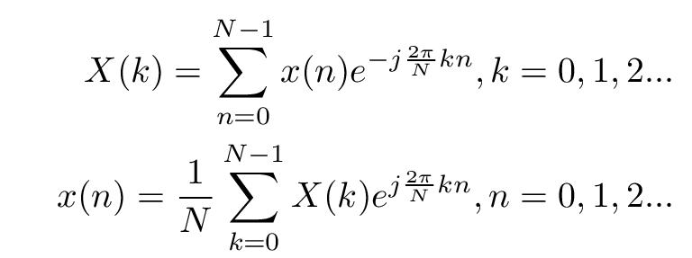

<!-- for math equations - MathJax -->
<script src='https://cdnjs.cloudflare.com/ajax/libs/mathjax/2.7.4/MathJax.js?config=default'></script>
# Transformata Fouriera sygnałów dyskretnych- splot, modulacja, okna

## Wstęp
### Właściwości transformaty Fouriera
<!--  -->
w dalsze części stosowane są następujące oznaczenia:
\\(F(.)\\) - transformata fouriera
\\(g(t), h(t)\\) - sygnały w dziedzinie czasu
\\(G(omega) = F(f(t))\\) - wielkimi literami oznaczono transformaty Fouriera sygnałów.

Można wskazać następujące, podstawowe właściwości transformaty Fouriera, które dotycząc operacji arytmetycznych na sygnale:
- liniowość transformaty:
$$
F(g(t) + h(t)) = G(\omega) + H(\omega)
$$
- iloczyn (modulacja) sygnałów w dziedzinie czasu jest równoważne splotowi (*) transformat
$$
F(g(t) \cdot h(t)) = G(\omega) * H(\omega)
$$
- splot sygnałów w dziedzinie czasu jest równoważny iloczynowi transformat
$$
F(g(t) * h(t)) = G(\omega) \cdot H(\omega)
$$

Wykreśl i przeanalizuj widma następujących sygnałów:
$$
y_1 = sin(2\cdot \pi \cdot f_1 \cdot t)\\
$$

$$
y_2 = sin(2\cdot \pi\cdot f_2\cdot t)\\
$$

$$
y_3 = y_1\cdot  y_2\\
$$

$$
y_4 = pulse(t, PW=0.5)\\
$$

$$
y_5 = y_1\cdot pulse(t, PW=0.5)
$$
``` python
import pylab as py
import numpy as np
from scipy.fft import fft, fftfreq
from scipy import signal

def sin(f = 1, T = 1, Fs = 128, phi =0 ):
    dt = 1.0/Fs
    t = np.arange(0,T,dt)
    s = np.sin(2*np.pi*f*t + phi)
    return (s,t)  


Fs = 500
T = 1
f_1 = 100
f_2 = 10

(y_1,t) = sin(f = 100.0, T=T, Fs=Fs)
y_2 = np.sin(2*np.pi*f_2*t)
y_3 = y_1*y2
y_4 = signal.square(2 * np.pi * t/T,0.5)
y_5 = y_1*y_4
```
Wyznacz widma sygnałów \\(y_1\\) - \\(y_4\\) i przeanalizuj otrzymane wyniki dla widm. Zwróć szczególną uwagę na zmianę która występuję przy  modulacji dwóch sygnałów.


### Sygnał, którego częstotliwość nie jest dokładnie reprezentowana w dziedzinie częstotliwości:
<!--  -->
Rozdzielczość widma dana jest zależnością:
$$
\Delta f = \frac{1}{T_{obserwacji}}
$$
Wygeneruj widmo sygnału, którego częstotliwość nie jest dokładnie reprezentowany w widmie. Możesz np. nieznacznie skrócić okres obserwacji sygnałów y_1 i y_2 (np. do 0.98s). Co się zmieni w widmie sygnałów?
Obserwowane efekt ujawnia rzeczywisty efekt wyznaczania transformaty fouriera sygnału o skończonej długości - sygnał ten jest wycinany za pomocą okna prostokątnego a co za tym idzie w widmie widoczny jest efekt splotu sygnału z oknem prostokątnym.
W przypadku gdy długość sygnału zawiera dokłądnie całkowitą liczbą okresów sygnału, efekt ten nie jest obserwowany, ponieważ funkcja \\(sinc(x)\\) próbkowana jest w miejscach zerowych, natomiast w innym przypadku efekt ten zawsze będzie się ujawniał (wystarczy dodać/usunąć nawet pojedynczą próbkę sygnału)

### Zwiększanie rozdzielczości sygnału - zero padding
Metodą na zwiększanie ilości binów w transformacie Fouriera jest przedłużanie sygnału zerami (zero-padding). Jest to szczególny przypadek następującego podejścia: Nasz "prawdziwy" sygnał jest długi. Oglądamy go przez prostokątne okno, które ma wartość 1 na odcinku czasu, dla którego próbki mamy dostępne i 0 dla pozostałego czasu. W efekcie możemy myśleć, że oglądany przez nas sygnał to efekt przemnożenia "prawdziwego" sygnału przez okno. Efekty takiego przedłużania proszę zbadać:

- dla sygnału sinusoidalnego o dł. 0.1s i częstości 10Hz próbkowanego 100 Hz


### Zmniejszanie przecieków częstotliwości metodą okien
Jak to już zaznaczono powyżej, wyznaczenie transformaty Fouriera sygnału o skończonej długości odpowiada wymnożeniu go przez okno prostokątne. Transformatą okna prostokątnego jest funkcja `sinus cardinalis`, która charakteryzuje się wąskim listkiem głównym, i listkami bocznymi o stosunkowo wysokich amplitudach, co jest źródłem tzw. przecieków częstotliwości i może wpływać na rozmycie widma sygnału. Głowną przyczyną dla której widmo okno prostokątne zawiera tak szeroki zakres częstotliwości jest nieciągłość funkcji (skokowa zmiana wartości). Istnieją inne kształty okien, posiadające zdecydowanie węższe charakterystyki widmowe. Najczęściej spotykanymi są okna Hanna, Hamminga, Blackmanna czy Flattop. Opis funkcyjny oraz ich kształty możesz znaleźć [tutaj](https://en.wikipedia.org/wiki/Window_function).

Przeanalizuje wynik działania następującego skryptu:
``` python
def spect_dB(s, N_fft, F_samp):
    S = rfft(s,N_fft)
    S_dB = 20 * np.log10(np.abs(S))
    F = rfftfreq(N_fft, 1.0/F_samp)
    return (S_dB,F)

fs=100
f=5

plt.figure()

k=1
for T in np.linspace(1,1.2,4):
    t = np.arange(0,T,1/fs)
    window = ss.windows.hann(len(t))#
    s = np.sin(2*np.pi*f*t)
    s_wnd = s* window
    plt.subplot(4,1,k)
    plt.title(f'T={T}')
    S_wnd, F = spect_dB(s_wnd,len(s), fs)
    S, F = spect_dB(s,len(s), fs)
    plt.plot(F,S_wnd)
    plt.plot(F,S)
    
    k=k+1
```
- Jak zmienia się widmo sygnału bez zastosowania okna Hann'a w zależności od długości sygnału?
- Co tak na prawdę daje okno Hann'a?


## Zadania
1. Stosując metodę `zerro padding` zbadaj następujące sygnały:
- dla sygnału sinusoidalnego o dł. 0.1s i częstości 10Hz próbkowanego 100 Hz
- dla sygnału sinusoidalnego o dł. 0.1s i częstości 22Hz próbkowanego 100 Hz
- dla sygnału będącego suma dwóch powyższych

2. Stosując okno prostokątne,Blackmanna, Hanna i Hanninga, wyznacz sumę sygnału o częstotliwości \\(f\\)=10.2Hz z pojedynczymi składowymi o częstotliwości \\(f_2\\) wygenerowanej przez funkcję `np.linspace(11.4,15.5,9)`. W pojedynczym porównaniu porównaj sygnał o wyznaczenia widma wykorzystaj funkcję `spect_dB`. W analizie najłatwiej będzie porównywać dane, gdy na jednym wykresie umieścisz dane dla pojedynczej kombinacji \\(f\\) i \\(f_2\\) i wszystkich okien. Przyjmij, że częstotliwość próbkowania \\(f_s\\)=100Hz a okres obserwacji T=1s
   
3. Spróbuj odczytać parametry [sygnału](_resources/lab_2/test_signal_z_3.hdf) częstotliwość próbkowania, długość w [s] oraz liczbę składowych  harmonicznych oraz ich częstotliwości, wiedząc że sygnał zawiera <7 składowych, a dane umieszczone są w Dataframie, gdzie indeksem jest czas

4. Spróbuj stworzyć prosty filtr, który z widma sygnału wytnie skłądową 50Hz (pamiętaj że wycięcie skłądowej z widma oznacza usunięcie skłądowej o częstotliwości 50Hz i fs-50Hz). Przygotuj następujący sygnał syntetyczny:
$$
y = sin(2\cdot \pi \cdot 10 \cdot t) + 0.5 \cdot sin(2\cdot \pi \cdot 45 \cdot t) + 2 \cdot sin(2\cdot \pi \cdot 50 \cdot t)
$$
gdzie częstotliwość próbkowania fs = 500Hz
Filtrację wykonaj dla dwóch sytuacji:
- dla okresu obserwacji 1s
- dla okresu obserwacji 1.11s
W celu porównania efektów filtracji nałóż na siebie sygnał syntetyczny bez skłądowej 50Hz oraz sygnał przefiltrowany. Możesz również wyświetlić różnicę tych sygnałów. 
Obserwacje zapamiętaj, będą potrzebne na kolejnych zajęciach.

   


<!-- 4. Metodą na zwiększanie ilości binów w transformacie Fouriera jest przedłużanie sygnału zerami (zero-padding). Jest to szczególny przypadek następującego podejścia: Nasz "prawdziwy" sygnał jest długi. Oglądamy go przez prostokątne okno, które ma wartość 1 na odcinku czasu, dla którego próbki mamy dostępne i 0 dla pozostałego czasu. W efekcie możemy myśleć, że oglądany przez nas sygnał to efekt przemnożenia "prawdziwego" sygnału przez okno. Efekty takiego przedłużania proszę zbadać:

- dla sygnału sinusoidalnego o dł. 0.1s i częstości 10Hz próbkowanego 100 Hz
- dla sygnału sinusoidalnego o dł. 0.1s i częstości 22Hz próbkowanego 100 Hz
- dla sygnału będącego suma dwóch powyższych

Jak można zinterpretować wyniki tego eksperymentu w świetle twierdzenia o splocie? -->


---
Autorzy: *Piotr Kaczmarek*
