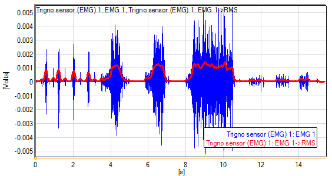

<!-- for math equations - MathJax -->
<script src='https://cdnjs.cloudflare.com/ajax/libs/mathjax/2.7.4/MathJax.js?config=default'></script>
# Podstawy przetwarzania sygnału EMG

## Wprowadzenie
Sygnał EMG może być przetwarzany na wiele różnych sposobów. Zasadniczo w zastosowaniu do zadań rozpoznawania i klasyfikacji (np. gestów) przetwarzanie składa się z następujących faz:
1. Preprocessing - filtracja sygnału, usuwanie artefaktów ruchowych zakłóceń sieciowych, resampling
2. Normalizacja sygnału
3. Wykrywanie sygnału EMG
4. Ekstrakcja cech w oknie przesuwnym. Cechy liczone są w oknie o długości 100ms - 1s, okno przesuwane jest o `stride`, który determinuje częstotliwość pracy klasyfikatora. W przypadku EMG wielokanałowego, najczęściej cechy wyznaczane są oddzielne dla każdego kanału osobno
5. Klasyfikacja/regresja - w wersji podstawowej jest realizowana przez system nie rekursywny

### Ekstrakcja cech
W aktualnym ćwiczeniu, bazujemy na kilku podstawowych cechach amplitudowych wyznaczanych w ruchomym oknie:
1. Wartość RMS dla kanału `i`:
$$
RMS_i=\sqrt{\frac{\sum_{i=1}^{n}\left(x_{i}-x_{0}\right)^{2}}{n}},
$$

Wynik wyznaczenia wartości RMS w ruchomym oknie przedstawiono na rysunku:


2. Liczba przejść przez zero
   $$
   ZC= \sum\limits_{i=1}^{N-2}u[(x_{i+1}-x_{i})(x_{i+1}-x_{i+2})]
   $$
   w wersji z progowaniem, można wyznaczyć wartość bezwzględną sygnału i zliczać liczbę przejść przez wartość progu
3. Wykrywanie aktywności
    liczba przejść przez zero, po zastosowaniu strefy nieczułości może być wykorzystana do wykrywania początku skurczu
### Normalizacja
Operacja normalizacji jest jednym z podstawowych wymogów skutecznej klasyfikacji. W zakresie analizy sygnału EMG amplituda sygnału EMG zależy od cech osobnicznych, lokalizacji elektrod, oraz parametrów fizycznych kontaktu między elektrodą a skórą. Zazwyczaj, dla uzyskania powtarzalnych efektów sygnał EMG, jest normalizowanny względem maksymalnego skurczy dowolnego, tzn wartości sygnału EMG podczas, której użytkownik generuje maksymalną siłę skurczu (np. zaciska pięść)

Współczynnik normalizujący możemy wyznaczyć osobno dla każdego kanału/mięśnia. Najczęściej wyznacza się wartość RMS w oknie 500ms lub dłuższym (zależnym od czasu trwania skurczu). Jako wartość współczynnika przyjmuje się maksymalną, zaobserwowaną wartość sygnału RMS dla danego kanału.
$$
norm_i = max(RMS_i)  
$$

normalizacja sygnału:
$$
^{norm}x_i = x_1/norm_i
$$

## Zadanie
1. Wczytaj sygnał [MVC](https://chmura.put.poznan.pl/s/4UuSx0lfK53FA7I), i sygnał [treningowy](https://chmura.put.poznan.pl/s/38aeyGzigLEHLbp)
2. Napisz funkcję rms, zc, które dla każdego kanału (kolumna `columns_emg`) wyznaczy wartości 3 opisanych powyżej cech
   ``` python
    feature_rms = rms(signal, window=500, stride=100, fs=5120, columns_emg=['EMG_8', 'EMG_9'])# wartści długości okna i przesunięcia w [ms]
    
    feature_zc = zc(signal, threshold=0.1, window=500, stride=100, fs=5120, columns_emg=['EMG_8', 'EMG_9'])# wartści długości okna i przesunięcia w [ms]
    ```
3. Analizując kolumnę `TRAJ_GT` zauważ, że wartość gestu `0` odpowiadającą brakowi ruchu (ręka jest w stanie neutralnym) (więcej na temat poszczególnych gestów można znaleźć [tutaj](https://biolab.put.poznan.pl/putemg-dataset/).Dla każdego kanału wyznacz wartość progu dla funkcji `zc`, zakładając, że próg stanowi wartość, dla której mieści się 95% wszystkich próbek szumu
 ``` python
    threshold = find_threshold(signal, columns_emg=['EMG_8', 'EMG_9'], column_gesture='TRAJ_GT', idle_gesture_id = 0)
    
 ```
4. Napisz funkcję `norm_emg` normalizującą sygnał emg
``` python
    norm_coeffs = rms(signal_mvc, window=500, stride=100, fs=5120, columns_emg=['EMG_8', 'EMG_9']).max()
    norm_emg = norm_emg(signal, norm_coeffs, columns_emg=['EMG_8', 'EMG_9'])
```
5. Zastanów się i sprawdź, jak na wartości współczynników wpłynie zastosowanie filtru artefaktów ruchowych i składowej sieciowej?

6. (*dla chętnych*)  Stosując metodę k-średnich i współczynniki shiluette, spróbuj dokonać nienadzorowanej klastryzacji zarejestrowanych danych, wiedząc, że identyfikator wykonywanego gestu znajduje się w kolumnie `TRAJ_GT`. Pomiń wszystkie gesty, które mają wartość -1. Wyniki wyświetl w postaci macierzy pomyłek.
   jako pomoc, możesz wykorzystać np. [kod](https://scikit-learn.org/stable/auto_examples/cluster/plot_kmeans_assumptions.html#sphx-glr-auto-examples-cluster-plot-kmeans-assumptions-py). Macierz konfuzji powinna być zwracana jako tablica `numpy.ndarray`
   ``` python
   window = 500/1000*fs
   stride = 100/1000*fs
   y_true = signal.iloc[window::stride]
   features = features_rms.join(features_zc)
   cm = k_mean(features, y_true)
   ```

 