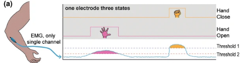

<!-- for math equations - MathJax -->
<script src='https://cdnjs.cloudflare.com/ajax/libs/mathjax/2.7.4/MathJax.js?config=default'></script>
# Budowa prostego interfejsu HMI opartego o jednokanałowy sygnał EMG

## Wprowadzenie
<!-- Sygnał EMG może być przetwarzany na wiele różnych sposobów. Zasadniczo w zastosowaniu do zadań rozpoznawania i klasyfikacji (np. gestów) przetwarzanie składa się z następujących faz:
1. Preprocessing - filtracja sygnału, usuwanie artefaktów ruchowych zakłóceń sieciowych, train
2. Normalizacja sygnału
3. Wykrywanie sygnału EMG
4. Ekstrakcja cech w oknie przesuwnym. Cechy liczone są w oknie o długości 100ms - 1s, okno przesuwane jest o `stride`, który determinuje częstotliwość pracy klasyfikatora. W przypadku EMG wielokanałowego, najczęściej cechy wyznaczane są oddzielne dla każdego kanału osobno
5. Klasyfikacja/regresja - w wersji podstawowej jest realizowana przez system nie rekursywny -->
Dzisiejsze zajęcia są poświęcone budowie prostego interfejsu HMI, wykorzystującego kod stworzony podczas kilku poprzednich zajęć laboratoryjnych i wykorzystany do sterowania ruchem gracza w labiryncie
Interfejs będzie umożliwiaj generację 2 komend. np. ruch w lewo i w prawo, które będą określana na podstawie analizy wartości RMS sygnału zarejestrowanego w pojedynczym kanale EMG. Ogólny sposób działania takiego interfejsu ma postać 



DO działania prócz wykorzystania elementów opracowanych na poprzednich zajęciach (filtracja wstępna, wyznaczanie cech) potrzebna będzie normalizacja sygnału, pozwalająca wyrazić w procentach strefy aktywności (zakresy wartości RMS)

### Normalizacja
Operacja normalizacji jest jednym z podstawowych wymogów skutecznej klasyfikacji. W zakresie analizy sygnału EMG amplituda sygnału EMG zależy od cech osobnicznych, lokalizacji elektrod, oraz parametrów fizycznych kontaktu między elektrodą a skórą. Zazwyczaj, dla uzyskania powtarzalnych efektów sygnał EMG, jest normalizowanny względem maksymalnego skurczy dowolnego, tzn wartości sygnału EMG podczas, której użytkownik generuje maksymalną siłę skurczu (np. zaciska pięść)

Współczynnik normalizujący możemy wyznaczyć osobno dla każdego kanału/mięśnia. Najczęściej wyznacza się wartość RMS w oknie 500ms lub dłuższym (zależnym od czasu trwania skurczu). Jako wartość współczynnika przyjmuje się maksymalną, zaobserwowaną wartość sygnału RMS dla danego kanału.
$$
norm_i = max(RMS_i)  
$$

normalizacja sygnału:
$$
^{norm}x_i = x_1/norm_i
$$

## Zadanie
1. Wczytaj sygnał [MVC](https://chmura.put.poznan.pl/s/4UuSx0lfK53FA7I),  lub zarejestruj sygnał z czujnika Trigno. Rejestracja powinna obejmować:
   - wykonanie maksymalnego skurczu (4-8s), 
   - wykonanie słabego skurczu (4-8s)
   - wykonanie umiarkowanie silnego skurczu (4-8s)

**Uwaga:** Te dane możesz wykorzystać do przygotowania i przetestowania poszczególnych elementów składowych budowanego systemu oraz do wyznaczenia progów.

2. Napisz funkcję `norm_emg` normalizującą sygnał emg
``` python
    norm_coeffs = rms(signal_mvc, window=500, stride=100, fs=5120, columns_emg=['EMG_8', 'EMG_9']).max()
    norm_emg = norm_emg(signal, norm_coeffs, columns_emg=['EMG_8', 'EMG_9'])
```
3. Wyznacz współczynnik normalizujący dla danych z sensora Trigno
4. Stwórz pipeline integrujący dane z sensora Trigno:
   - akwizycja danych
   - filtracja
   - wyznaczanie rms, pamiętaj, żeby integrować sygnał zawsze o tej samej długości, stąd do gromadzenia danych użyj [bufora cyklicznego](https://docs.python.org/3/library/collections.html#collections.deque) określając maksymalną długość bufora (`maxlen`) na taka jaka ustawiona jest jako okno funkcji RMS 
   - zastosowanie normalizacji
   - klasyfikator w postaci funkcji progowania.  Funkcja powinna zwracać 3 wartości:
     - `idle` - 0-30% (lub progi pośrednie) MVC
     - `command_1` - 30-50% MVC
     - `command_2` - >60% MVC
     - zintegrować prostą [grę](https://github.com/biolab-put/maze_hmi), tak by było możliwe sterowanie za pomocą komend z progowania zintegrowanych w metodzie `Maze.on_execute()`
 