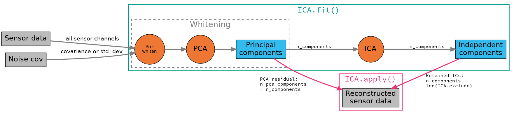

<!-- for math equations - MathJax -->
<script src='https://cdnjs.cloudflare.com/ajax/libs/mathjax/2.7.4/MathJax.js?config=default'></script>
# Lab12. Metoda Anlizy składowych niezależnych (ICA) w zastosowaniu do filtracji sygnału EEG

## Wprowadzenie
Analiza składowych niezależnych (ICA) to technika szacowania niezależnych sygnałów źródłowych z zestawu nagrań, w których sygnały źródłowe zostały zmiksowane w nieznanych proporcjach. Typowym  przykładem może być problem ślepej separacji źródeł (BSS): np. przy 3 instrumentach muzycznych grających w tym samym pomieszczeniu i 3 mikrofonach nagrywających występ (każdy odbiera wszystkie 3 instrumenty, ale na różnych poziomach), czy można w jakiś sposób „rozmieszać” sygnały nagrane przez 3 mikrofony, dzięki czemu otrzymujesz osobne „nagranie” izolujące dźwięk każdego instrumentu?

W sygnale analizie sygnału EEG istnieje podobny problem, elektrody rejestrują aktywność pewnych interferujących źródeł , którymi mogą być zarówno ośrodki kory mózgowej, jak również aktywność elektryczna serca, mięśni głowy oraz zmiany wywołane ruchami głowy i ruchem gałek ocznych.Tak długo jak te źródła są statystycznie niezależne i niegausowskie, jest możliwe ich odseparowanie za pomocą ICA i rekonstrukcja oryginalnego sygnału z pominięciem części składowych.

Wstęp do metody ICA z wykorzystaniem pakietu sklearn można znaleźć [tutaj](https://scikit-learn.org/)

### ICA w pakiecie MNE
W MNE zaimplementowanych jest kilka algorytmów ICA, których najpopularniejszym jest `fastica` (domyślny), na uwagę zasługuje również algorytm `piccard`, który jest bardziej odporny na gdy źródła są częściowo skorelowane (co ma miejsce w przypadku aktywności rejestrowanej w sygnale EEG). Ponieważ w dalszej części ICA będzie wykorzystywana do usuwania artefaktów ruchowych a nie filtracji przestrzennej i generowania cech, daej wykorzystywana będzie metoda `fastica`.

Ponieważ danymi wejściowymi dla algorytmu ICA powinny być dane niezależne i znormalizowane, funkcja `mne.ICA` realizuje preprocessing polegający na:
- normalizacji każdego kanału na podstawie macierzy kowariancji szumu (`noise_cov`) (która może byc podana jako argument, lub wyznaczona bezpośrednio na przetworzonym sygnale)
- usunięcia składowej stałej (biasu)
- Wyznaczeniu `n_pca_components` składowych głównych metody PCA
Pipeline przedstawiono na poniższym 

## Dane
[Dane](https://mne.tools/stable/overview/datasets_index.html#sample-dataset) zawierają rejestrację aktywności mózu podczas wielomodalnej stymulacji gdzie dostępne są zarówno dane z systemu EEG, MAG jak również fMRI)


W przetwarzaniu wykorzystywany będzie moduł `nme`
W celu zainstalowania potrzebnych modułów użyj `pip`
``` python
pip install nme
pip install ipywidgets
jupyter nbextension enable --py widgetsnbextension
```

Wczytane dane ogranioczone zostaną do 60s obserwacji.
``` python
import os
import mne
from mne.preprocessing import (ICA, create_eog_epochs, create_ecg_epochs,
                               corrmap)

sample_data_folder = mne.datasets.sample.data_path()
sample_data_raw_file = os.path.join(sample_data_folder, 'MEG', 'sample',
                                    'sample_audvis_raw.fif')
raw = mne.io.read_raw_fif(sample_data_raw_file)
raw.crop(tmax=60.)

```

Przeanalizuj dane używając funkcji `raw.plot()`, spróbuj znaleźć kanały dla których obserwowane są artefakty. Na podstawie ich kształtu i właściwości określ ich genezę.

Możesz również ograniczyć liczbę wyświetlanych kanałów:

``` python
regexp = r'(MEG [12][45][123]1|EEG 00.)'
artifact_picks = mne.pick_channels_regexp(raw.ch_names, regexp=regexp)
raw.plot(order=artifact_picks, n_channels=len(artifact_picks),
         show_scrollbars=True)
```
### Analiza artefaktów od ruchu gałek ocznych (EOG)
MNE zawiera funkcje: `find_eog_events()` i `create_eog_epochs()`, umożliwiające znajdywanie oraz podział sygnału wg czasu wystąpienia artefaktu eog.
```python
eog_evoked = create_eog_epochs(raw)
eog_evoked.apply_baseline(baseline=(None, -0.2))
eog_evoked.plot_image(combine='mean')
eog_evoked.average().plot_joint()
```

### Analiza artefaktów od ruchu gałek ocznych (EOG)
MNE zawiera funkcje: `find_ecg_events()` i `create_ecg_epochs()`, umożliwiające znajdywanie oraz podział sygnału wg czasu wystąpienia artefaktu ecg, które używa się analogicznie jak metody dla EOG
<!-- ```python
eog_evoked = create_ecg_epochs(raw)
eog_evoked.apply_baseline(baseline=(None, -0.2))
eog_evoked.plot_image(combine='mean')
eog_evoked.average().plot_joint()
``` -->

### Usuwanie wolnozmiennej składowej stałej (dryftu)
Obecność dryftu sygnału negatywnie wpływa na skuteczność metody ICA. WYnika to z faktu, że wolnozmienna składowa zmniejsza niezależność komponentów, o których zakłada się, że są niezależnymi źródłami sygnału. 
NME ma wbudowany m.in. [filtr fir](https://mne.tools/stable/generated/mne.io.Raw.html#mne.io.Raw.filter) projektowany metodą okien
``` python
filt_raw = raw.copy()
filt_raw.load_data().filter(l_freq=1., h_freq=None)
```
### ICA
Wyznaczenie `n_components=15` (ograniczonych za pomocą PCA) składowych głównych oraz ich wizualizacja może mieć formę:
```
ica = ICA(n_components=15, max_iter='auto', random_state=97)
ica.fit(filt_raw)
raw.load_data()
ica.plot_sources(raw, show_scrollbars=False)
```
Można również wyplotować mapy aktywności dla poszczególnych komponentów:
``` python 
ica.plot_components()
```

Na powyższych wykresach jest dość oczywiste, które układy przechwytują  artefakty EOG i EKG. Spróbuj określć który komponent jest charakterystycznych dla sygnału EOG i przypisz jego numer do zmiennej `eog_comp`. Dla pewności istnieją dodatkowe sposoby ich wizualizacji. Po pierwsze, możemy wykreślić nałożony oryginalny sygnał na na zrekonstruowany sygnał z wykluczonymi artefaktowymi, używając `plot_overlay`:
``` python
# eog
eog_comp = ...
ica.plot_overlay(raw, exclude=[eog_comp], picks='eeg')
# # ecg
# ica.plot_overlay(raw, exclude=[1], picks='mag')
```
Można również wyświetlić wykres diagnostyczny dla każdej ze składowych niezależnych:
```python
ica.plot_properties(raw, picks=[eog_comp])
```

Na końcu możemy wskazać składowe do usunięcia:
``` python
ica.exclude = [eog_comp] 
# ica.apply() dokonuje modyfikocji `in place` stąd najpierw trzeba utworzyć kopię
reconst_raw = raw.copy()
ica.apply(reconst_raw)

raw.plot(order=artifact_picks, n_channels=len(artifact_picks),
         show_scrollbars=False)
reconst_raw.plot(order=artifact_picks, n_channels=len(artifact_picks),
                 show_scrollbars=False)
del reconst_raw
```
## Zadanie
1. Uruchom przykład i przeanalizuj wyniki
2. Tą samą procedurę zastosuj do usunięcia dodatkowo skłądowej od zakłócenia EKG, zweryfikuj wyniki
3. Usuń wszystkie artefakty przez przypisanie do zmiennej `ica.exclude` listy komponentów
4. Zmierz maksymalną i minimalną amplitudę kanału `MEG 1511` i kanału `EEG 001` po usunięciu artefaktów


 