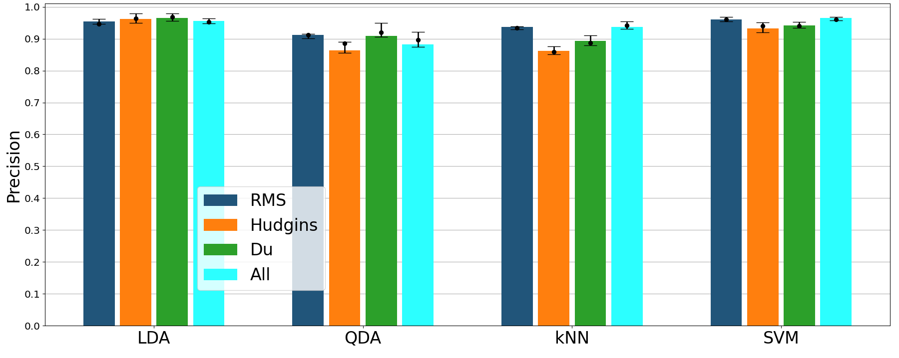

<!-- for math equations - MathJax -->
<script src='https://cdnjs.cloudflare.com/ajax/libs/mathjax/2.7.4/MathJax.js?config=default'></script>
# Lab10. Wybór cech z sygnału EMG

## Wprowadzenie
Dzisiejsze zajęcia dotyczą problemu wyboru cech sygnału EMG. Metody były omawiane na wykładzie. W praktyce często używa się metod owijających, których celem jest wybór zestawu cech maksymalizującego dokładność modelu. Z uwagi na dużą złożoność obliczeniową, zajmiemy się metodami wybór cech opartymi o model lasu drzew decyzyjnych.

Poniżej na 3 kolejnych wykresach możesz zobaczyć jakie są wyniki klasyfikacji (z kroswalidacją) dla zbioru,którym dzisiaj będziesz się zajmował,w przypadku, gdy używa się wszystkie cechu (984 -zbiór oznaczony jako `all` oraz zredukowany zestaw cech `Hudgkin`, `Du`, `RMS`).

Porównanie kilku klasyfikatorów i cech:


Porównanie skuteczności klasyfikacji dla 24 kanałów:


Porównanie skuteczności klasyfikacji dla 8 kanałów (nr 9-16):


## Zadanie
1. Dany jest [zbiór danych](https://chmura.put.poznan.pl/s/kYXVEkHWbx14HBB) zawierający dwa zbiory danych (każdy zbiór składa się ze zbioru uczącego i testowego). Zbiory zawierają po 984, wyznaczone cechy. Nazwy kolumn zawierających cechy mają formę: `input_(NR)_(cecha)_(kanal)` np.: `input_456_MYOP_1` jest cechą `MYOP` wyznaczoną dla kanału 1.
2. Uruchom następujący kod umożliwiający określenie istotnych cech:
``` python
import numpy as np
import pandas as pd
from sklearn.ensemble import RandomForestClassifier
from sklearn.metrics import precision_score
from sklearn.inspection import permutation_importance
import matplotlib.pyplot as plt
from sklearn.metrics import confusion_matrix


path ='.' #dataset folder

data_train= pd.read_hdf(f'{path}/train_03_2018-06-14_2_All')
data_test= pd.read_hdf(f'{path}/test_03_2018-06-14_2_All')
columns = list(data_train.filter(regex='input').columns)

X_train = data_test[columns]
y_train = data_test['output_0']
X_test = data_test[columns]
y_test = data_test['output_0']


clf = RandomForestClassifier(random_state=100)
clf_full = clf.fit(X_train,y_train)
preds = clf.predict(X_test)

print(precision_score(preds, y_test, average='macro'))
print(confusion_matrix(y_test, preds))

```
3. Przeanalizuj wyniki oceny ważności cech za pomocą lasu drzew decyzyjnych:
``` python
top_n=20 #number of top features to show
tree_feature_importances = clf.feature_importances_
sorted_idx = tree_feature_importances.argsort()
sorted_idx = sorted_idx[-top_n:]
y_ticks = np.arange(0, len(sorted_idx))
cols_ord =  [columns[i] for i in sorted_idx]
fig, ax = plt.subplots()
ax.barh(y_ticks, tree_feature_importances[sorted_idx])
ax.set_yticks(y_ticks)
ax.set_yticklabels(cols_ord)
ax.set_title("Random Forest Feature Importances")
fig.tight_layout()
plt.show()
```
4. Porównaj otrzymane wyniki z oceną istotności cech otrzymaną z testu permutacyjnego dla zbioru testowego:
``` python
result = permutation_importance(clf, X_test, y_test, n_repeats=10,
                                random_state=0, n_jobs=2)
sorted_idx = result.importances_mean.argsort()[-30:]

fig, ax = plt.subplots()
ax.boxplot(result.importances[sorted_idx].T, vert=False, labels=X_test.columns[sorted_idx])
ax.set_title("Permutation Importances (test set)")
fig.tight_layout()
plt.show()
```
5. Powodem dla którego test permutacyjny zwraca  wynik, nie pozwalający na ocenę istotności cech, jest duża liczba cech skorelowanych. Należy więc usunąć cechy które są silnie zależne od siebie. Proces ten bedzie złożony z 2 faz: wyboru cech oraz wyboru kanałów
6. Dokonaj analizy podobieństwa cech za pomocą dendrogramu, zakładając że analizujemy podobieństwo cech wyznaczonych dla jednego kanału:
``` python

import numpy as np
from scipy.cluster.hierarchy import dendrogram, linkage, distance, fcluster
from matplotlib import pyplot as plt


df = data_train.filter(regex='input.*12$')
corr = df.corr().values

pdist = distance.pdist(np.abs(corr))
Z = linkage(pdist, method='ward')

labelList = list(df.columns)
plt.figure(figsize=(15, 12))
dendrogram(
            Z,
            orientation='right',
            labels=labelList,
            distance_sort='descending',
            show_leaf_counts=False
          )

plt.show()
th=2.0
plt.axvline(x=, c='grey', lw=1, linestyle='dashed')

```
Które cechy są podobne, ile jest różnych klastrów na zaproponowanym poziomie odcięcia?

7. Usuń cechy podobne, wybierając jako reprezentanta pierwszą cechę z grupy, następnie wygeneruj cechy dla wszystkich kanałów:
``` python
idx = fcluster(Z, th, 'distance')
v = [[id, v.split('_')[2]] for id, v in zip(idx, df.columns)]
selected_features = pd.DataFrame(v, columns=['cluster', 'feature']).groupby('cluster').first()

#generacja cech dla wszystkich kanałów
columns = list([])
for feature in selected_features['feature']:
    col_f = data_train.filter(regex=f'input_\d+_{feature}_').columns
    columns.extend(col_f)
```
8. Sprawdź jaki będzie wynik klasyfikacji oraz czy możliwa jest ocena istotności cech za pomocą testu permutacyjnego?
9. Analogicznie do procedury z pkt 7. dokonaj redukcji liczby kanałów. Załóż, że ocena będzie prowadzona dla jednej cechy (`RMS`) wyznaczonej dla wszystkich kanałów. Przyjmij próg odcięcia dla wyboru grup cech th=0.2. Zmodyfikuj kod z pkt 7. w taki sposób, by lista `columns` zawierała wyłączenie kolumny zgodne z zredukowaną listą cech oraz elektrod.
10. Sprawdź jaki będzie wynik klasyfikacji oraz czy możliwa jest ocena istotności cech za pomocą testu permutacyjnego? 
11. Z listy cech wyznaczonej z testu permutacyjnego i ułożonej w kolejności od najbardziej istotnej do najmniej istotnej wybierz top-15 cech i wyznacz dokładność klasyfikacji, porównaj ją z dokładnością dla zbioru zredukowanego cech (po przycięciu dendrogramu) oraz pełnego zbioru cech?
12. Wczytaj dane uczące i testowe zarejestrowane dla tej samej osoby w inny dzień (`train/test_03_2018-05-11_2_All`)i oceń, powtarzając procedurę z pkt 11, czy wybrany zbiór cech działa poprawnie również dla tych danych? 


 